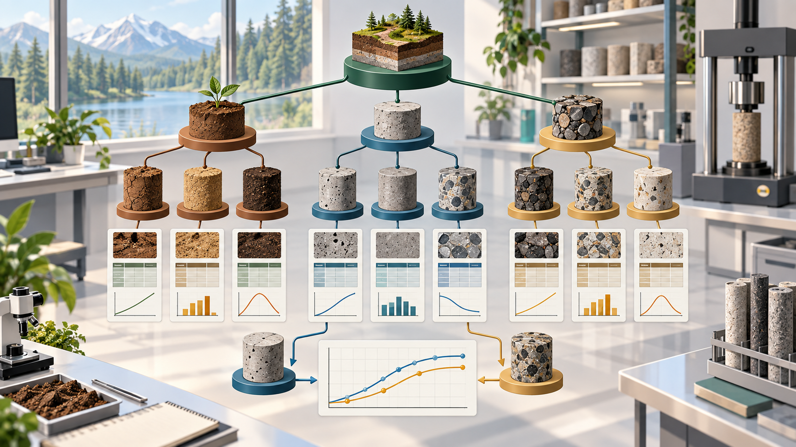

# Specimen Hub · 试样数据管理平台


<p align="center">
  
</p>

## 📖 项目简介 (Introduction)

**试样数据管理平台** 是一款**结构化、可视化、交互式**的解决方案。能够**可视化**清晰管理数据，并**自动生成各类图表**。大大节省整理excel、照片、手写记录以及数据处理的时间。
<div align="center">
  
  <br> <p>图 1：欢迎界面</p>
</div>

## ✨ 核心功能 (Key Features)

### 1. 🗂️ 结构化项目管理
* **树状层级**：采用 `项目 -> 试样 -> 数据` 的树状结构，逻辑清晰。
* **一体记录**：按试样记录，参数、图片、表格等均可丢入试样。
* **快速新建**：支持右键“复制参数新建”，快速创建同批次试样。
<div align="center">
  
  <br> <p>图 2：试样界面</p>
  
  <br> <p>图 3：快速新建与快速赋值</p>
</div>

### 2. 📊 数据自动生图
* **自动计算**：根据日期自动计算时间，根据质量自动计算变化率。
* **实时生图**：导入质量、应力应变原始数据，实时生图，直观观察规律。
* **批量操作**：支持将数据转移给其他试样，只需微调，提高效率。
<div align="center">
  
  <br> <p>图 4：数据实时自动生图</p>
</div>

### 3. ⚖️ 多维对比分析
* **横向对比**：勾选多个试样，可视化对比质量、应力应变等数据。
* **变量分析**：选取关键配方变量，可视化研究该配方对强度影响。
* **AI 辅助**：自动生成AI分析提示词（Prompt），一键复制给AI深入分析。
<div align="center">
  
  <br> <p>图 5：选取试样横向对比</p>
  
  <br> <p>图 6：一键复制生成分析报告</p>
</div>

### 4. 🖼️ 附件画廊
* **集中存储**：每个试样拥有独立附件库，拖拽文件即可归档。
<div align="center">
  
  <br> <p>图 7：拖拽文件便捷管理</p>
</div>

## 🛠️ 安装与运行 (Installation)


### 1. 环境要求
* Python 3.10 或更高版本

### 2. 克隆项目
```bash
git clone https://github.com/chidou59/specimen-hub.git
cd specimen-hub
```

### 3. 安装依赖
建议使用虚拟环境运行本项目。

**如果你有 requirements.txt 文件：**
```bash
pip install -r requirements.txt
```

**如果没有，请手动安装以下核心库：**
```bash
pip install PySide6 matplotlib pandas openpyxl pillow
```

### 4. 启动软件
```bash
python main.py
```

## 📂 项目结构 (Project Structure)

```text
specimen-hub/
├── config.py               # 全局配置及路径管理
├── main.py                 # 程序入口
├── src/
│   ├── controllers/        # 控制器层 (业务逻辑)
│   │   └── file_manager.py # 核心文件管理逻辑 (CRUD)
│   ├── views/              # 视图层 (UI 界面)
│   │   ├── main_window.py  # 主窗口框架
│   │   ├── sample_view.py  # 试样详情页 (仪表盘布局)
│   │   ├── chart_widget.py # 质量趋势图组件
│   │   ├── stress_chart.py # 应力应变图组件
│   │   └── dialogs.py      # 各类弹窗 (新建、编辑、录入)
│   └── utils/              # 工具类
│       ├── data_importer.py# 数据导入解析 (Pandas)
│       └── image_helper.py # 图像处理工具
└── README.md
```

更完整的数据边界和模块职责见 [`docs/ARCHITECTURE.md`](docs/ARCHITECTURE.md)。

## 🖥️ 使用指南 (Usage)

1.  **首次运行**：软件会提示选择一个文件夹作为**数据仓库**（Data Root）。所有的实验数据将保存在该文件夹下的 JSON 文件中。
2.  **创建项目**：点击工具栏的“新建项目”，输入实验名称。
3.  **录入试样**：在项目下新建试样，选择形状（圆柱/立方体等），输入初始质量。
4.  **数据记录**：
    * 在“质量监控”卡片点击“记录”添加不同天数的质量。
    * 在“应力应变”卡片点击“导入”，选择实验机导出的 CSV/Excel 文件。
5.  **导出结果**：在任意图表右下角点击导出按钮，获取高清图表用于论文撰写。

## 🤝 贡献 (Contribution)

欢迎提交 Issue 或 Pull Request 来改进这个项目！

## 📄 许可证 (License)

本项目采用 MIT 许可证。
